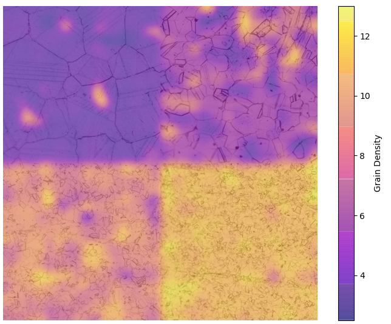

**A study on robust feature representations for grain density estimates in austenitic steel**<br>
OAGM 2021<br>
Filip Ilic, Marc Masana, Lea Bogensperger, Harald Ganster, Thomas Pock

---

[[ Project Page ]](http://f-ilic.github.io/RobustFeatureAustenit)
[[ Paper ]](https://f-ilic.github.io/papers/RobustFeatureAustenit/ilic21RobustFeatureAustenit.pdf)

## Setup
Requirements:
* pytorch
* torchvision
* numpy 
* scipy
* matplotlib 
* PIL

## Background

If you have a regression problem such that you can transform it into a classification problem, you can use the implict class ordering with this modified gradCAM algorithm to get per-pixel class correspondences.
In the image below is the output of this 'pixel wise' gradCAM ('pixelGradCAM'). In our case the goal is to classify the grain densities in austenitic steel, and to find inhomogenieties within the samples.
This artifically spliced image, consisting of 4 different images, each of a different grain density (see legend) shows the result of applying pixelGradCAM on it.

It clearly shows that the learned model is performing as expected.


## Run

To run the small example of PixelGradCam:
|cmd| out|
|:--------:|:-------:|
 |```python pixelGradCAM.py```||

 ---

<br><br><br>


 If this is useful to you, please cite

```
@inproceedings{ilic21oagm,
  title={A study on robust feature representations for grain density estimates in austenitic steel},
  author={Ilic, Filip and Masana, Marc and Bogensperger, Lea and Ganster, Harald and Pock, Thomas},
  booktitle={Proc. Workshop of the Austrian Association for Pattern Recognition (AAPR/OAGM)},
  year={2021}
}
```


